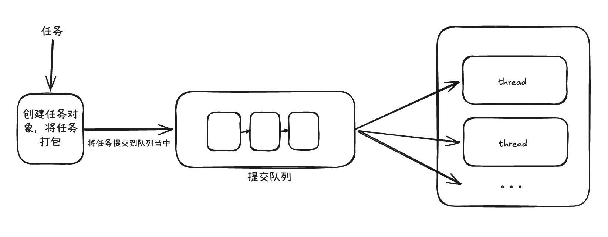

# A Manual Thread Pool Implementation

## Overview

This project implements a simple thread pool in C++11. It demonstrates:

1. A **task queue** for pending tasks.
2. **Worker threads** that retrieve and execute tasks.
3. **Synchronization** with a mutex and a condition variable.
4. **Asynchronous result delivery** with `std::packaged_task` and `std::future`.

The implementation is based on [progschj/ThreadPool](https://github.com/progschj/ThreadPool), with additional comments and explanations for beginners.

> **Learning project:** This implementation is intended for studying the basic principles of thread pools. It is not production-ready. Production systems should use a mature thread-pool library, such as [Boost.Thread](https://www.boost.org/doc/libs/release/doc/html/thread.html) or [oneTBB](https://github.com/oneapi-src/oneTBB).

The English source comments in this project were generated with AI assistance and reviewed for consistency with the implementation.

## Prerequisites

- Basic Linux knowledge
- C++11
- CMake
- Basic knowledge of C++ generic programming

## Environment

- Operating system: Ubuntu 24.04 LTS
- C++ standard: C++11
- Compiler: GCC 13+
- CMake: 3.26+

## Thread Pool Structure



### Task Queue

Pending tasks are stored as:

```cpp
std::queue<std::function<void()>> tasks;
```

Every queued task is represented as a callable object that takes no arguments and returns `void`. A user task that returns a value is wrapped in `std::packaged_task`, and a `void()` lambda is placed in the queue to invoke it later.

### Worker Threads

The constructor creates the requested number of worker threads. Each worker repeatedly:

1. Locks the task queue.
2. Sleeps on the condition variable when no task is available.
3. Removes one task and releases the lock.
4. Executes the task.
5. Waits for the next task.

Workers exit only when the pool is stopping and the task queue is empty. Therefore, tasks already submitted are drained during destruction.

### Synchronization

- `std::mutex queue_mutex` protects the task queue and the `stop` flag.
- `std::condition_variable condition` lets idle workers sleep and wakes them when work is available.
- `bool stop` indicates that the pool is shutting down.

## Usage

The header file is named `thread_pool.h`:

```cpp
#include "thread_pool.h"

#include <iostream>

int main() {
    ThreadPool pool(4);

    pool.enqueue([] {
        std::cout << "Hello from the thread pool!" << std::endl;
    });
}
```

When `pool` leaves scope, its destructor notifies the workers and waits for them to finish.

## Retrieving a Task Result

`enqueue` returns a `std::future`. Call `future.get()` to wait for the task and retrieve the value returned by the task:

```cpp
#include "thread_pool.h"

#include <iostream>

int main() {
    ThreadPool pool(4);

    auto future = pool.enqueue([](int a, int b) {
        return a + b;
    }, 10, 20);

    int result = future.get();
    std::cout << result << std::endl; // 30
}
```

`future.get()`:

- Blocks if the task has not finished.
- Returns the task's result after completion.
- Rethrows an exception stored by the task.
- Usually can be called only once for the same `future`.

Use `future.wait()` when you only need to wait for completion:

```cpp
future.wait();
```

## `ThreadPool` Interface

```cpp
class ThreadPool {
public:
    ThreadPool(size_t numThreads);

    template<class F, class... Args>
    auto enqueue(F&& f, Args&&... args)
        -> std::future<typename std::result_of<F(Args...)>::type>;

    ~ThreadPool();

private:
    std::vector<std::thread> workers;
    std::queue<std::function<void()>> tasks;
    std::mutex queue_mutex;
    std::condition_variable condition;
    bool stop;
};
```

## Constructor and Worker Loop

The constructor initializes `stop` to `false` and creates `numThreads` workers:

```cpp
ThreadPool::ThreadPool(size_t numThreads) : stop(false) {
    for (size_t i = 0; i < numThreads; ++i) {
        workers.emplace_back([this] {
            while (true) {
                std::function<void()> task;

                {
                    std::unique_lock<std::mutex> lock(queue_mutex);

                    condition.wait(lock, [this] {
                        return stop || !tasks.empty();
                    });

                    if (stop && tasks.empty()) {
                        return;
                    }

                    task = std::move(tasks.front());
                    tasks.pop();
                }

                task();
            }
        });
    }
}
```

### `condition.wait`

```cpp
condition.wait(lock, [this] {
    return stop || !tasks.empty();
});
```

A worker wakes when either:

- shutdown has started; or
- the task queue is not empty.

While waiting, `wait` temporarily releases the lock. After waking, it reacquires the lock and checks the predicate again. This protects the queue from concurrent access.

### Execute Outside the Lock

```cpp
task = std::move(tasks.front());
tasks.pop();
```

The worker leaves the locked scope before executing:

```cpp
task();
```

This keeps the lock held for a short time and prevents a long-running task from blocking other workers from retrieving tasks.

## `enqueue`

`enqueue` accepts any callable object and arguments, binds them into a zero-argument task, and puts the task into the queue:

```cpp
template<class F, class... Args>
auto enqueue(F&& f, Args&&... args)
    -> std::future<typename std::result_of<F(Args...)>::type> {
    using return_type = typename std::result_of<F(Args...)>::type;

    auto task = std::make_shared<std::packaged_task<return_type()>>(
        std::bind(
            std::forward<F>(f),
            std::forward<Args>(args)...
        )
    );

    std::future<return_type> result = task->get_future();

    {
        std::unique_lock<std::mutex> lock(queue_mutex);

        if (stop) {
            throw std::runtime_error("enqueue on stopped ThreadPool");
        }

        tasks.emplace([task] {
            (*task)();
        });
    }

    condition.notify_one();
    return result;
}
```

### Return Type Deduction

```cpp
using return_type = typename std::result_of<F(Args...)>::type;
```

`std::result_of` deduces the return type of a callable with the supplied arguments:

```cpp
[] { return 42; }             // return_type is int
[](int n) { return n * 2; }   // return_type is int
[] { /* no return value */ }  // return_type is void
```

`std::result_of` is the C++11 form. In C++17 and later, `std::invoke_result` is generally preferred.

### `std::packaged_task` and `std::future`

The two objects are connected through a shared state:

```text
packaged_task                         future
     |                                  |
     | executes and writes the result   | waits and reads the result
     +------------ shared state --------+
```

The sequence is:

1. `std::packaged_task<return_type()>` wraps the user task.
2. `task->get_future()` creates the associated `std::future`.
3. A `void()` wrapper is placed in the task queue.
4. A worker executes `(*task)()`.
5. The value returned by the user task is written to the shared state.
6. `future.get()` waits for completion and reads the result.

The task queue stores the operation that invokes the task; it does not directly store the return value. The `packaged_task` writes the return value to the shared state, and the `future` reads it.

Exceptions are stored in the shared state and rethrown by `future.get()`:

```cpp
auto future = pool.enqueue([]() -> int {
    throw std::runtime_error("task failed");
});

try {
    int result = future.get();
} catch (const std::exception& e) {
    std::cerr << e.what() << std::endl;
}
```

### Why `std::make_shared` Is Used

The task is queued first and executed later by a worker. A local `packaged_task` would be destroyed when `enqueue` returned. Capturing the shared pointer in the queued lambda keeps the task alive until execution finishes:

```cpp
auto task = std::make_shared<std::packaged_task<return_type()>>(...);

tasks.emplace([task] {
    (*task)();
});
```

## Destructor

```cpp
ThreadPool::~ThreadPool() {
    {
        std::unique_lock<std::mutex> lock(queue_mutex);
        stop = true;
    }

    condition.notify_all();

    for (std::thread& worker : workers) {
        worker.join();
    }
}
```

The destructor:

1. Sets `stop` to `true` while holding the mutex.
2. Wakes all waiting workers with `notify_all()`.
3. Allows workers to drain the remaining tasks.
4. Lets workers exit when `stop == true` and the queue is empty.
5. Calls `join()` to wait for every worker.

## Example Program

The project's `main.cpp` submits eight tasks to a pool with four worker threads:

```cpp
#include "thread_pool.h"

#include <chrono>
#include <iostream>
#include <thread>

int main() {
    ThreadPool pool(4);

    for (int i = 0; i < 8; ++i) {
        pool.enqueue([i] {
            std::cout << "Task " << i
                      << " is being processed by thread "
                      << std::this_thread::get_id() << std::endl;

            std::this_thread::sleep_for(std::chrono::seconds(1));
        });
    }

    std::this_thread::sleep_for(std::chrono::seconds(5));
}
```

These tasks return `void`, so the example does not store their futures. The destructor still waits for all workers to finish. In real code, save and wait on the futures when exact task completion or returned values matter instead of relying on a fixed sleep duration.

## Build and Run

```bash
cmake -S . -B build
cmake --build build
./build/thread_pool
```

## Related Images

- [Thread pool structure](img/thread_pool.png)
- [Worker execution flow](img/thread_excuete.png)
